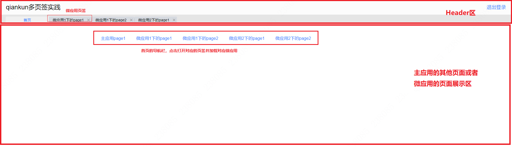
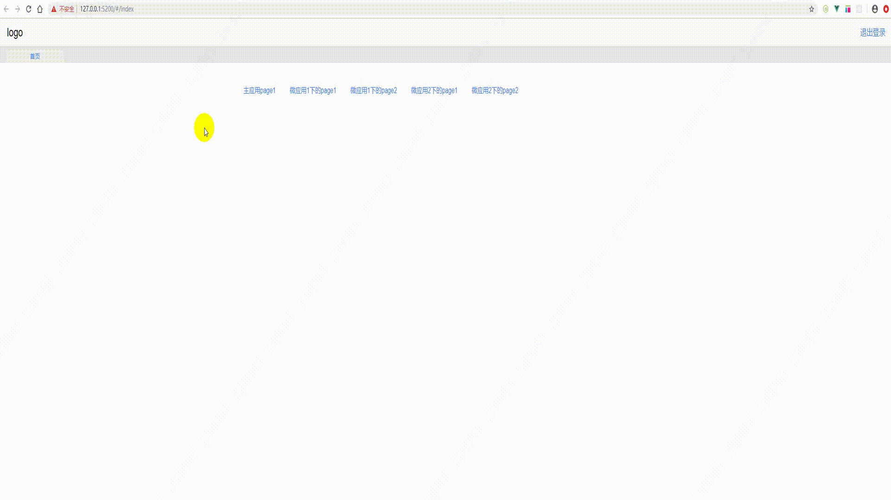

# 基于 qiankun 的微前端多页签项目实践与总结
## 前言
最近参与的项目用到了```qiankun```微前端架构系统，于是抽离成基础的demo示例，并写下此篇文章总结下开发过程中遇到的一些问题和解决方法。

这里具体只记如何实现多页签下挂载不同微应用的不同页面，并实现微应用对应页面缓存的加载与销毁，有关```qiankun```微前端的介绍这里不做赘述，敬请查阅[qiankun官方文档](https://qiankun.umijs.org/zh/guide)。

**示例代码：** [https://github.com/luckyfrogg/qiankun-multiple-tabs](https://github.com/luckyfrogg/qiankun-multiple-tabs)

### **项目架构**

如上图，demo项目包含了一个主应用，两个微应用。
目前主微应用均采用```Vue2.0```搭建，后续将会增加```React```微应用。

**目录结构**
```
├── main       // 主应用
├── micro-app1  // 微应用1
└── micro-app2    // 微应用2
```
## 开始
安装所有主微应用的依赖
```
npm install
```
启动所有应用
```
npm start
```
## 主应用配置
1. 安装 ```qiankun```
   ```
   $ yarn add qiankun # 或者 npm i qiankun -S
   ```
2. 有关```qiankun```的配置或方法都放到 ```main/src/config/microAppConfig.js ```下
   ```javascript
    import store from '@/store'
    import { loadMicroApp } from 'qiankun'
    export const microAppList = [
        {
            id: 'micro1',
            name: 'micro-1',
            entry: 'https://127.0.0.1:5201',
            container: '#micro1',
            activeRule: '#/micro-1'
        },
        {
            id: 'micro2',
            name: 'micro-2',
            entry: 'https://127.0.0.1:5202',
            container: '#micro2',
            activeRule: '#/micro-2'
        }
    ]
    /**
    * @description 查找当前页签是否是微应用下的页面
    */
    export function isMicroApp(path) {
        return !!microAppList.some(item => {
            return path.startsWith(item.activeRule.substring(1))
        })
    }
    /**
    * @description 查找当前页签是否是微应用下的页面，并返回对应微应用配置项
    */
    export function findMicroAppByPath(path) {
        return microAppList.find(item => {
            let activeRule = item.activeRule.substring(1)
            return path.startsWith(activeRule)
        })
    }
    /**
    * @description 创建微应用
    */
    export function createMicroApp(path) {
        return new Promise((resolve, reject) => {
            const loadedMicroApps = { ...store.state.loadedMicroApps } // 已手动挂载的微应用对象
            if (!isMicroApp(path)) {
                // 非微应用直接跳转
                resolve()
                return
            }

            // 微应用跳转处理
            /**
            * @description 1.判断是否已手动加载，是则直接跳转，否则先手动挂载，再跳转
            */
            const microAppResult = findMicroAppByPath(path) // 是否是微应用的跳转
            if (Object.prototype.hasOwnProperty.call(loadedMicroApps, microAppResult.name)) {
                resolve()
                return
            }
            try {
                loadedMicroApps[microAppResult.name] = loadMicroApp(microAppResult) // 加载微应用
                store.dispatch('setLoadedMicroApps', loadedMicroApps)
                // console.log('挂载后的已挂载的微应用==>', store.state.loadedMicroApps)
                resolve()
            } catch (err) {
                reject(err)
                console.log(err)
            }
        })
    }
   ```
   ```createMicroApp```方法在主应用的启动页面 ``` main/src/views/index/index.vue ``` 下点击模块跳转时调用，用于判断是否是微应用页面并手动加载微应用。

3. 有关```vuex```的相关配置在``` main/src/store/ ``` 下，其中 ``` mutations.js ``` 如下
   ```js
    import Vue from 'vue'
    import { randomString } from '@/utils/tools'
    export default {
        setTabs(state, val) {
            if (!val || !val.length) {
                let defaultTabs=[{
                    id: randomString(8),
                    title: '首页',
                    originRoute: {
                        path: '/',
                        query: {},
                        params: {}
                    },
                    realRoute: {
                        path: '/',
                        query: {},
                        params: {}
                    },
                    active: true,
                    closeAble: false,
                    cachePaths: [],
                    history: [],
                    isIframe: false
                }]
                localStorage.setItem('tabs',JSON.stringify(defaultTabs))
                state.tabs = [...defaultTabs]
                return
            }
            localStorage.setItem('tabs', JSON.stringify(val))
            state.tabs = val
        },
        setIframes(state, val) {
            state.iframes = val
        },
        setLoadedMicroApps(state, val) {
            state.loadedMicroApps = val
        },
    }
   ```
   ```setTabs```用于存储当前tabs数组，主要用于 ``` TabsBar.vue ``` 下```watch```监听页签数据改变，```localStorage```下存的tabs用于刷新页面页签保持

4. 有关页签的处理放到了 ``` main/src/utils/tabs.js ``` 中，在 ``` main.js ```中挂载到```Vue```原型上
   ```js
    import _ from 'lodash'
    import store from '@/store'
    import router from '@/router'
    import { randomString, isIframe } from '@/utils/tools'
    import { createMicroApp, findMicroAppByPath } from '@/config/microAppConfig.js'
    import actions from '@/shared/qiankun_actions'
    class Tabs {
        constructor() {
            !this.getLocalTabs() && this.setLocalTabs([])
            this.initTabs()
        }
        /**
        * 初始化Tabs
        */
        initTabs() {
            this.compareTabs = this.getLocalTabs()
            this.tabs = this.getLocalTabs()
        }
        /**
        * 将最新的Tabs保存到vuex中
        */
        setLocalTabs(tabs = this.tabs) {
            store.dispatch('setTabs', tabs)
            this.initTabs()
        }
        getLocalTabs() {
            return _.cloneDeep(JSON.parse(localStorage.getItem('tabs')))
        }
        /**
        * 需要新开标签页时调用
        * @param  el
        */
        async openTab(el) {
            let realRoute = el
            // console.log('openTab===>', el)
            let openedTab = this.tabs.find(item => {
                return item.originRoute.path === el.path
            }) // 查找已打开的当前Tabs
            if (openedTab && openedTab.realRoute) {
                // 如果存在已经打开的tab，取realRoute的path，跳转
                realRoute = openedTab.realRoute
            }
            let isExist = false
            this.tabs.forEach(item => {
                if (item.originRoute.path === el.path) {
                    item.active = true
                    isExist = true // 已经存在
                } else {
                    item.active = false
                }
            })
            let currentId = randomString(8)
            let tab = {
                id: currentId,
                title: el.title,
                originRoute: {
                    path: el.path,
                    query: el.query || {},
                    params: el.params || {}
                },
                active: true,
                closeAble: true,
                history: [],
                cachePaths: [realRoute.path],
                isIframe: isIframe(el.path)
            }
            if (!isExist) {
                this.tabs.push(tab)
            }
            // if (!isIframe(el.path)) {
            router
                .replace({ path: realRoute.path, query: realRoute.query || {}, params: realRoute.params || {} })
                .then(to => {
                    // 只有在新增成功之后才会添加标签页
                    this.tabs.forEach(item => {
                        if (item.originRoute.path === el.path) {
                            item.realRoute = {
                                path: to.path,
                                title: to.title,
                                query: to.query,
                                params: to.params
                            }
                        }
                    })
                    this.setLocalTabs(this.tabs)
                })
                .catch(() => {
                    this.initTabs()
                })
            // } else {
            //     router.replace({ path: '/iframe', query: { id: currentId } })
            //     this.setLocalTabs(this.tabs)
            // }
        }
        /**
        * 切换页签Tab时调用
        */
        async switchTab(el) {
            let { path, query = {}, params = {} } = el.realRoute
            this.tabs.forEach(item => {
                item.active = el.id === item.id
            })
            this.setLocalTabs(this.tabs)
            // if (!isIframe(path)) {
            createMicroApp(path).then(res => {
                router.replace({ path, query, params })
            })
            // } else {
            //     router.replace({ path: '/iframe', query: { id: this.activeTab.id } })
            // }
        }
        /**
        * 关闭页签
        * @description 遍历tabs找到选中的页签，
        * 如果当前页签的active为true，移除的同时，将后一项active设为true;
        * 如果没有后一项则将前一项active设为true;
        * 如果当前页签的active不为true,则直接移除就行
        */
        closeTab(el) {
            /**
            * 这里的逻辑需要改：
            * 当前页签下可能不止打开过一个微应用（e.g:流程中心页签下打开流程设计器），所以需要去遍历所有微应用，对每个微应用进行相应的unmount或者update处理
            */
            let tabLength = this.tabs.length
            let currentIndex = this.tabs.findIndex(item => {
                return item.id === el.id
            })
            if (el.active) {
                let selectIndex = 0
                if (currentIndex + 1 === tabLength) {
                    // 说明是最后一项，移除将前一项active设为true
                    this.tabs[currentIndex - 1].active = true
                    selectIndex = currentIndex - 1
                } else {
                    this.tabs[currentIndex + 1].active = true
                    selectIndex = currentIndex + 1
                }
                let realRoute = this.tabs[selectIndex].realRoute
                router.replace({ path: realRoute.path, query: realRoute.query || {}, params: realRoute.params || {} })
            }
            let loadedMicroApps = store.state.loadedMicroApps
            this.tabs.splice(currentIndex, 1)
            let microApp = findMicroAppByPath(el.realRoute.path)
            // console.log('this.tabs=>', this.tabs)
            try {
                if (microApp) {
                    let currentMircoApp = loadedMicroApps[microApp.name]
                    let currentMicroAppHasLeftTab = this.tabs.some(item => {
                        // 判断当前微应用是否还存在其他已经打开的页面，如果没有，直接销毁该微应用；如果有，通知微应用清除当前标签页keepAlive缓存
                        return item.realRoute && item.realRoute.path.match(microApp.activeRule.substring(1))
                    })
                    if (!currentMicroAppHasLeftTab) {
                        // 直接销毁该微应用
                        currentMircoApp.unmount()
                        delete loadedMicroApps[microApp.name]
                        store.dispatch('setLoadedMicroApps', loadedMicroApps)
                    } else {
                        let routeNameList = [...new Set([el.realRoute.path, ...el.cachePaths])]
                        routeNameList = routeNameList.map(item => {
                            item = item.split('/')[2]
                            return item
                        })
                        currentMircoApp.update({ props: { type: 'closeTab', tabNameList: routeNameList } }) // 当点击关闭页签时需要通知微应用销毁当前页面keep-alive
                    }
                }
                this.setLocalTabs(this.tabs)

                // debugger
            } catch (error) {
                this.setLocalTabs(this.tabs)
            }
        }
        /**
         * 关闭所有非固定页签并销毁微应用或微应用中已缓存的页面
        */
        async closeAllTabs(el) {
            // 关闭所有非固定页签并销毁微应用或微应用中已缓存的页面
            let firstFixedTabIndex = this.tabs.findIndex(item => {
                return !item.closeAble
            }) // 首页
            if (el && el.id !== this.tabs[firstFixedTabIndex].id) {
                let realRoute = this.tabs[firstFixedTabIndex].realRoute
                router.replace({ path: realRoute.path, query: realRoute.query || {}, params: realRoute.params || {} })
            }
            let needCloseTabs = this.tabs.filter(item => {
                return item.closeAble
            })
            for (let i = 0; i < needCloseTabs.length; i++) {
                try {
                    let items = needCloseTabs[i]
                    let currentIndex = this.tabs.findIndex(citem => {
                        return citem.id === items.id
                    })
                    this.tabs.splice(currentIndex, 1)
                    let loadedMicroApps = store.state.loadedMicroApps
                    let microApp = findMicroAppByPath(items.realRoute.path)
                    if (microApp) {
                        let currentMircoApp = loadedMicroApps[microApp.name]
                        let currentMicroAppHasLeftTab = this.tabs.some(item => {
                            return item.realRoute && item.realRoute.path.match(microApp.activeRule.substring(1))
                        })
                        if (currentMircoApp) {
                            if (!currentMicroAppHasLeftTab) {
                                // 直接销毁该微应用
                                await currentMircoApp.unmount()
                                delete loadedMicroApps[microApp.name]
                                store.dispatch('setLoadedMicroApps', loadedMicroApps)
                            } else {
                                let routeNameList = [...new Set([items.realRoute.path, ...items.cachePaths])]
                                routeNameList = routeNameList.map(item => {
                                    item = item.split('/')[2]
                                    return item
                                })
                                await currentMircoApp.update({ props: { type: 'closeTab', tabNameList: routeNameList } }) // 当点击关闭页签时需要通知微应用销毁当前页面keep-alive
                            }
                        }
                    }
                } catch (error) {
                    console.log(error)
                }
            }
            this.setLocalTabs([])
        }
        /**
        * 登录时调用
        */
        async resetTabs() {
            /*this.$store.state.showApp=false
            this.$nextTick(()=>{
                this.$store.state.showApp=true
            })*/
            let loadedMicroApps = store.state.loadedMicroApps
            console.log('登录时是否有已挂载的微应用=>', loadedMicroApps && Object.values(loadedMicroApps).length)
            if (loadedMicroApps && Object.values(loadedMicroApps).length) {
                // 如果有已挂载的微应用，直接清除掉所有的
                let hasRegisterMicroApps = Object.values(loadedMicroApps)
                for (let item of hasRegisterMicroApps) {
                    try {
                        await item.unmount()
                    } catch (error) {
                        console.log(error)
                    }
                }
            }
            store.dispatch('setLoadedMicroApps', {})
            console.log('登录时已挂载的微应用=>', store.state.loadedMicroApps)
            this.setLocalTabs([])
        }
        /**
        * 跳转到当前页签的首页
        * @param el
        */
        turnToFirstPage(el) {
            this.tabs.forEach(item => {
                if (el.path === item.originRoute.path) {
                    item.cachePaths = []
                    item.realRoute.name = item.name
                    item.realRoute.path = item.path
                    item.realRoute.query = item.query
                    item.realRoute.params = item.params
                }
            })
            this.setLocalTabs(this.tabs)

            router.replace({ path: el.path, query: el.query || {}, params: el.params || {} })
        }
        /**
        * 页签内切换页面时，更新最新的realRoute
        * @param {*} to
        */
        setRealRoute(to) {
            if (!this.tabs || !this.tabs.length) return
            if (!this.currentTabHasChanged()) {
                // 路由修改，但还是在当前页签内,将新路由赋给active为true的
                this.activeTab.cachePaths = [...new Set([...this.activeTab.cachePaths, to.path])]
                this.activeTab.realRoute = {
                    path: to.path,
                    title: to.title,
                    query: to.query || {},
                    params: to.params || {}
                }
            }
            this.setLocalTabs(this.tabs)
        }
        /**
        * 判断页签是否发生了变化（新增页签，删除页签，切换页签等）
        */
        currentTabHasChanged() {
            let r1 = this.tabs.find(item => {
                return item.active
            })
            let r2 = this.compareTabs.find(item => {
                return item.active
            })
            // debugger
            return r1.id !== r2.id
        }
        /**
        * 当前选中的页签项
        */
        get activeTab() {
            return _.find(this.tabs, ['active', true])
        }
        activeTabHistoryPush() {
            actions.setGlobalState({ historyAction: null }) // 再置为null
            this.activeTab.history.push(this.activeTab.realRoute) // push当前选中的页签历史记录栈
        }
        activeTabHistoryPop() {
            actions.setGlobalState({ historyAction: null }) // 再置为null
            let lastRoute = this.activeTab.history.pop() // pop当前选中的页签历史记录栈
            if (!lastRoute) return
            router.replace({ path: lastRoute.path, query: lastRoute.query || {}, params: lastRoute.params || {} })
        }
        get activeTabHistoryAction() {
            return {
                null: () => {
                    return
                },
                push: this.activeTabHistoryPush.bind(this),
                pop: this.activeTabHistoryPop.bind(this)
            }
        }
    }
    let tabs = new Tabs()
    export default tabs
   ```
5. 主应用的布局在 ``` main/src/views/layout/layout.vue ``` 中，微应用的容器DOM也存放其中。**需要注意，判断是否加载容器时需要用 ```v-show``` 切勿用```v-if``` ！**
   ```html
    <template>
    <div class="layout-container">
        <Header></Header>
        <tab-bar></tab-bar>
        <div class="layout-main">
        <template v-show="!isMicroApp">
            <keep-alive>
            <router-view></router-view>
            </keep-alive>
        </template>

        <template v-show="isMicroApp">
            <div
            :id="item.id"
            v-for="item in microAppList"
            :key="item.id"
            v-show="isMicroApp"
            ></div>
        </template>
        </div>
    </div>
    </template>
    <script>
    import Header from "./components/Header";
    import TabBar from "./components/TabBar";
    import { microAppList, isMicroApp } from "@/config/microAppConfig.js";
    export default {
    name: "Layout",
    components: {
        Header,
        TabBar,
    },
    data() {
        return {
            microAppList
        };
    },
    methods: {
        isMicroApp() {
        return isMicroApp(this.$route.path);
        },
    },
    };
    </script>

    <style lang="less" scoped>
    .layout-container{
        .layout-main{
            padding: 12px;
        } 
    }
    </style>
   ```
6. 页签组件存放在 ``` main/src/views/layout/components/TabBar.vue ``` 下，包含的功能主要由切换页签，关闭页签等
7. 启动入口页面在 ``` main/src/views/index/index.vue ``` 下，点击相应链接会触发 ``` openLink ``` 方法
   ```js
   openLink(page) {
      let { path, query, title } = page
      createMicroApp(path).then(res => {
          this.$tabs.openTab({
              title,
              path,
              query
          })
      })
    }
   ```
8. 引入 ``` main/src/shared/qiankun_actions.js``` 用于主微应用间通信（传输token，用户信息，在微应用内部做页面跳转后通知主应用更新历史记录栈等）
## 微应用配置

由于需要实现切换或关闭页签时能够控制对应页面缓存的更新与销毁，所以这边主要的一个思路是路由跳转时先将需要缓存的页面存到```vuex```中，在```App.vue```中通过```keep-alive```组件支持的```include```引入存在```vuex```中的需要缓存的数组，关闭某一页签时触发```update```钩子函数手动将页面数组中对应项移除。

有关```include```的用法参考[Vue官方文档](https://cn.vuejs.org/v2/api/#keep-alive)。

具体的配置步骤如下：
1. 在 ``` src ``` 目录下新增 ```public-path.js ```
   ```js
    if (window.__POWERED_BY_QIANKUN__) {
    __webpack_public_path__ = window.__INJECTED_PUBLIC_PATH_BY_QIANKUN__;
    }
   ``` 
2. 在 ``` src ``` 目录下新增 ``` shared/qiankun_actions.js ```
   
3. 修改``` src/router/index.js ``` 路由文件：
   - 路由配置数组中，需要缓存的路由，需要设置```name```属性，且```name```的属性值需要和页面的```path```保持一致，在```meta```对象下设置```keepAlive```为```true```
        ```js
        const routes = [
            {
                path: '/p2',
                name: 'p2',// 需要设置keepAlive的页面（一般为列表页），其.vue文件和路由配置都需要设置一个name属性，其属性值需要保持一致
                component: () => import(/* webpackChunkName: "Index" */ '@/views/p2/p2.vue'),
                meta: {
                    keepAlive: true
                }
            },
            {
                path: '/p3',
                component: () => import(/* webpackChunkName: "Index" */ '@/views/p3/p3.vue')
            }]
        ```
   - 设置```qiankun```路由前缀
        ```js
        routes.forEach(element => {
            element.path = `${window.__POWERED_BY_QIANKUN__ ? '/micro-1' : ''}${element.path}`
        })
        ```
    - 改写```router.push```和```router.history.go```方法，用于通知主应用处理对应标签页的历史记录栈，禁用浏览器的前进后退
        ```js
        if (window.__POWERED_BY_QIANKUN__) {
            /**
            * 改写router.push方法，通知主应用将页面push进当前高亮的页签的history历史记录栈中
            */

            VueRouter.prototype.push = function push(location) {
                actions.setGlobalState({ historyAction: 'push' })
                return VueRouter.prototype.replace.call(this, location) // 改用router.replace的原因是为了避免产生浏览器的历史记录（防止产生浏览器的前进后退键造成页签切换有误）
            }
            /**
            * 改写router.history.go方法，通知主应用取出当前高亮的页签的history历史记录栈中最后一条页面数据等其他相应操作
            */
            const originalRouterHistoryGo = router.history.__proto__.go
            router.history.__proto__.go = function go(val) {
                if (val === -1) {
                    // 只对go(-1)进行了处理
                    return actions.setGlobalState({ historyAction: 'pop' })
                }
                return originalRouterHistoryGo.call(this, val)
            }
        }
        ```
    - ```beforeEach```中对需要缓存的页面进行处理
        ```js
        router.beforeEach((to, from, next) => {
            let keepAlive = store.state.keepAlive
            if (to.meta.keepAlive) {
                if (!keepAlive.includes(to.name)) {
                    keepAlive.push(to.name)
                    store.dispatch('SET_KEEP_ALIVE', keepAlive)
                }
            }
            next()
        })
        ```
4. ```App.vue```中主要代码如下
   ```html
    <div id="micro1">
        <keep-alive :include="keepAlive" v-if="isRouterAlive">
            <router-view></router-view>
        </keep-alive>
    </div>
   ```
5. 改写 ```main.js```，引入之前新增的 ``` public-path ```，改写```render```函数，添加```qiankun```生命周期，初始化组件通信等操作
   ```js
    import "./public-path";
    import Vue from "vue";
    import App from "./App.vue";
    import router from "./router";
    import store from "./store";
    import actions, { updateMicroAppStrategy } from './shared/qiankun_actions'
    Vue.config.productionTip = false;
    let instance = null;
    function render(props = {}) {
        const { container } = props;
        instance = new Vue({
            router,
            store,
            render: (h) => h(App),
        }).$mount(container ? container.querySelector("#micro1") : "#micro1");
    }

    // 独立运行时
    if (!window.__POWERED_BY_QIANKUN__) {
        render();
    }
    // 生命周期
    export async function bootstrap(props) {
        console.log('micro-app1微应用bootstrap', props)
        // console.log('[vue] vue app bootstraped')
    }
    export function mount(props) {
        console.log('micro-app1微应用mount', props)
        actions.setActions(props)
        render(props)
    }
    export async function unmount() {
        console.log('micro-app1微应用unmount')
        instance.$destroy()
        instance.$el.innerHTML = ''
        instance = null
        store.dispatch('SET_KEEP_ALIVE', [])
    }
    export async function update(payload) {
        console.log('micro-app1微应用update')
        let { props } = payload  
        updateMicroAppStrategy[props.type](props)
    }
   ```
6. 打包配置修改（```vue.config.js```）
   ```js
    const { name } = require('./package');
    module.exports = {
        devServer: {
            headers: {
            'Access-Control-Allow-Origin': '*',
            },
        },
        configureWebpack: {
            output: {
            library: `${name}-[name]`,
            libraryTarget: 'umd', // 把微应用打包成 umd 库格式
            jsonpFunction: `webpackJsonp_${name}`,
            },
        },
    };
   ```
   至此，主微应用的配置基本完成。
## 遇到的问题
1. 从微应用1页签切换到主应用或者微应用2页签，再切回到微应用1页签，微应用1页签下页面缓存失效，表单数据丢失？
   
   >答：不要使用```registerMicroApps```全局注册微应用，应用当路由切换到其他微应用页面以后该微应用就会销毁掉。  
   >**主应用在需要加载微应用的时候使用```loadMicroApp```方法手动挂载微应用，微应用在```beforeEach```中将页面存到```vuex```中，```keep-alive```通过```include```属性引入存在```vuex```中的页面数组，关闭某一页签时触发```update```钩子函数手动将页面数组中对应项移除。**

2. 点击返回按钮跳转的链接非当前页签下的内容？
   
   >答：这是因为前进返回调用的是浏览器的前进后退栈，当点击返回的时候可能出现对应页签已经关闭找不到需要高亮显示的页签情况。  
   >**针对每个页签实现```history```历史记录栈，将当前页签下页面切换后的历史页面数据保存到对应的页签```history```栈中，微应用中改写```router.push```和```router.go```方法，路由切换时通知主应用处理```history```栈**
## 预览

## 后期优化
 - ```qiankun```主微应用间的通信优化。
 - 微应用的缓存优化，目前微应用需要缓存的页面的路由需要保证```path/name```一致，微应用配置缺乏灵活性，微应用项目的开发人员需要严格遵循该规则来配置路由，增大了开发人员的心智负担。
 - 关闭页签方法优化，目前关闭页签只处理了销毁当前打开的页面的微应用，但实际情况是一个页签下可能不止挂载过一个微应用，应该销毁所有当前页签历史记录栈中有的微应用或其页面。

## 最后

该demo项目只实现多页签下的微应用之间的加载与跳转,有关样式隔离等其他```qiankun```相关问题请参考 [qiankun官方文档](https://qiankun.umijs.org/zh/faq) 或 [qiankun github Issues](https://github.com/umijs/qiankun/issues)

本篇文章旨在对实际开发过程的一个整理和总结，本项目并非最佳实践，仅供思路参考，如果文章中存在任何问题或者不足的地方欢迎指正交流，谢谢！  

